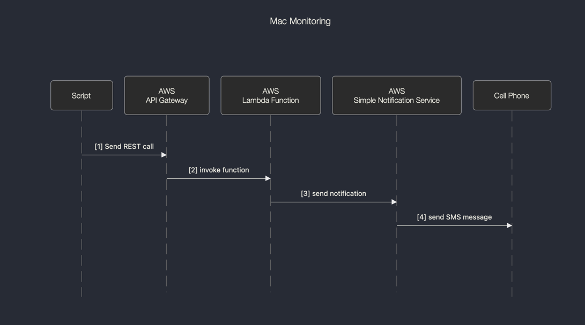

This utility happened because I wanted some way to be notified when a certain cell phone joined (or left) my wifi network.

This uses AWS facilities for reporting. Here's how it works: 

So, if the mac address enters or leaves the network, I get a SMS message on my cell phone.

For those of you who don't want to mess with AWS, you can use a service like [Pushover](https://pushover.net/)